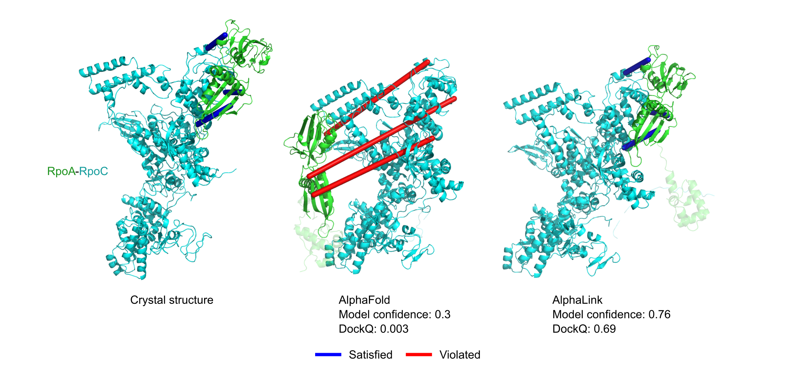

# AlphaLink2: Modelling protein complexes with crosslinking mass spectrometry and deep learning

Code for the paper ["Modelling protein complexes with crosslinking mass spectrometry and deep learning"](https://www.biorxiv.org/content/10.1101/2023.06.07.544059v2). We extend [AlphaLink](https://github.com/lhatsk/AlphaLink) to protein complexes. AlphaLink2 is based on [Uni-Fold](https://github.com/dptech-corp/Uni-Fold) and integrates crosslinking MS data directly into Uni-Fold. The current [networks](https://doi.org/10.5281/zenodo.8007238) were trained with simulated SDA data (25 Å Cα-Cα).


<center>
<small>
Figure 1. Prediction of RpoA-RpoC with real DSSO crosslinking MS data. Satisfied crosslinks are shown in blue (< 30 Å Cα-Cα) and violated crosslinks in red (> 30 Å Cα-Cα).
</small>
</center>


## Installation and Preparations

### Installing AlphaLink from scratch with conda/ pip
In part based on: https://github.com/kalininalab/alphafold_non_docker

### Create new conda environment
```	
conda create --name alphalink -c conda-forge python=3.10
conda activate alphalink
```

### Install Uni-Core

For Linux:
```
pip install nvidia-pyindex
pip install https://github.com/dptech-corp/Uni-Core/releases/download/0.0.3/unicore-0.0.1+cu118torch2.0.0-cp310-cp310-linux_x86_64.whl
```

For other systems, build [Uni-Core from scratch.](https://github.com/dptech-corp/Uni-Core#installation)


### Install utilities
```
conda install -y -c conda-forge openmm==7.7.0 pdbfixer
conda install -y -c bioconda hmmer hhsuite==3.3.0 kalign2
```

### Install AlphaFold - necessary for relax

```
pip install urllib3==1.26.16 tensorflow-cpu==2.13.0rc2
git clone https://github.com/deepmind/alphafold.git

cd alphafold
wget -q -P alphafold/common/ https://git.scicore.unibas.ch/schwede/openstructure/-/raw/7102c63615b64735c4941278d92b554ec94415f8/modules/mol/alg/src/stereo_chemical_props.txt
python setup.py install
cd ..
```


### Install AlphaLink2
```
git clone https://github.com/Rappsilber-Laboratory/AlphaLink2.git
cd AlphaLink2
python setup.py install
```

## Running AlphaLink

After set up, AlphaLink can be run as follows:

```bash
    bash run_alphalink.sh \
    /path/to/the/input.fasta \        # target fasta file
    /path/to/crosslinks.pkl.gz \      # pickled and gzipped dictionary with crosslinks
    /path/to/the/output/directory/ \  # output directory
    /path/to/model_parameters.pt \    # model parameters
    /path/to/database/directory/ \    # directory of databases
    2020-05-01                        # use templates before this date
```

## Running AlphaLink in ColabFold

The AlphaLink2 ColabFold can be found [here](https://colab.research.google.com/github/Rappsilber-Laboratory/AlphaLink2/blob/main/notebooks/alphalink2.ipynb).

## Crosslink input format

AlphaLink takes as input a python dictionary of dictionaries with a list of crosslinked residue pairs with a false-discovery rate (FDR). That is, for inter-protein crosslinks A->B 1,50 and 30,80 and an FDR=20%, the input would look as follows:

```
In [6]: crosslinks
Out[6]: {'A': {'B': [(1, 50, 0.2), (30, 80, 0.2)]}}
```

Intra-protein crosslinks would go from A -> A

```
In [6]: crosslinks
Out[6]: {'A': {'A': [(5, 20, 0.2)]}}
```

The dictionaries are 0-indexed, i.e., residues start from 0.


You can create the dictionaries with the generate_crosslink_pickle.py script by running

```
python generate_crosslink_pickle.py --csv crosslinks.csv --output crosslinks.pkl.gz
```

The crosslinks CSV has the following format (residues are 1-indexed).

residueFrom chain1 residueTo chain2 FDR

Example:

```
1 A 50 B 0.2
5 A 5 A 0.1
```

## Model weights
	
The model weights are deposited here: [](https://doi.org/10.5281/zenodo.8007238)


	
## Citing this work

If you use the code, the model parameters, or the released data of AlphaLink2, please cite

    
```bibtex
@article {Stahl2023,
	author = {Kolja Stahl and Oliver Brock and Juri Rappsilber},
	title = {Modelling protein complexes with crosslinking mass spectrometry and deep learning},
	elocation-id = {2023.06.07.544059},
	year = {2023},
	doi = {10.1101/2023.06.07.544059},
	publisher = {Cold Spring Harbor Laboratory},
	abstract = {Scarcity of structural and evolutionary information on protein complexes poses a challenge to deep learning-based structure modelling. We integrated experimental distance restraints obtained by crosslinking mass spectrometry (MS) into AlphaFold-Multimer, by extending AlphaLink to protein complexes. Integrating crosslinking MS data substantially improves modelling performance on challenging targets, by helping to identify interfaces, focusing sampling, and improving model selection. This extends to single crosslinks from whole-cell crosslinking MS, suggesting the possibility of whole-cell structural investigations driven by experimental data.Competing Interest StatementThe authors have declared no competing interest.},
	URL = {https://www.biorxiv.org/content/early/2023/06/09/2023.06.07.544059},
	eprint = {https://www.biorxiv.org/content/early/2023/06/09/2023.06.07.544059.full.pdf},
	journal = {bioRxiv}
}
```

Any work that cites AlphaLink2 should also cite AlphaFold and Uni-Fold.

## Acknowledgements

AlphaLink2 is based on [Uni-Fold](https://github.com/dptech-corp/Uni-Fold) and fine-tunes the network weights of [AlphaFold](https://github.com/deepmind/alphafold/).

### Code License

While AlphaFold's and, by extension, Uni-Fold's source code is licensed under the permissive Apache Licence, Version 2.0, DeepMind's pretrained parameters fall under the CC BY 4.0 license. Note that the latter replaces the original, more restrictive CC BY-NC 4.0 license as of January 2022

### Model Parameters License

The AlphaLink parameters are made available under the terms of the Creative Commons Attribution 4.0 International (CC BY 4.0) license. You can find details at: https://creativecommons.org/licenses/by/4.0/legalcode

### Third-party software

Use of the third-party software, libraries or code referred to in the [Acknowledgements](README.md/#acknowledgements) section above may be governed by separate terms and conditions or license provisions. Your use of the third-party software, libraries or code is subject to any such terms and you should check that you can comply with any applicable restrictions or terms and conditions before use.
